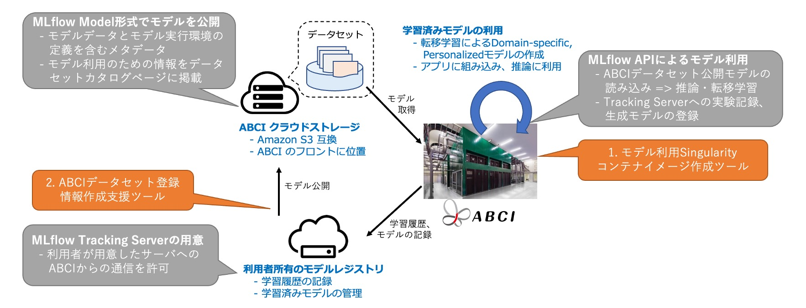

# Model tracking service

ABCIシステムで汎用学習済みモデルの共有・再利用を容易に行えるよう、Model Tracking Serviceを提供します。Model Tracking Serviceは、ABCIグループ単位でMLflow Tracking Serverをデプロイし管理できる`App for MLflow Server`と学習モデル公開や実行環境構築を支援するツールセットから構成されます。[ABCI Datasets](https://datasets.abci.ai/)と連携させて利用が可能です。そのイメージ図を以下に示します。

{width=640}

Model Tracking Serviceを理解するための各種サンプルコードを配置しています。

## Model Tracking Serviceの利用例(ML編)

Model Tracking Serviceについて機械学習(ML)を行う[利用例](./samples-ml-wine.md)をご紹介します。  
簡単なサンプルデータセットとして、MLflowの[Documentation](https://mlflow.org/docs/latest/index.html)に記載されている[sklearn_elasticnet_wine](https://github.com/mlflow/mlflow/tree/master/examples/sklearn_elasticnet_wine)を使用します。

## Model Tracking Serviceの利用例(LLM編)

Model Tracking Serviceについて大規模言語モデル(LLM)のファインチューニングを行う[利用例](./samples-llm-finetune.md)をご紹介します。  
ファインチューニングに用いるデータセットは、ベースモデルとしてHugging Faceに登録されている[`Cerebras-GPT-590M`](https://huggingface.co/cerebras/Cerebras-GPT-590M)を使用し、ファインチューニング用のデータセットとして[`kunishou/databricks-dolly-15k-ja`](https://huggingface.co/datasets/kunishou/databricks-dolly-15k-ja)を使用します。(ファインチューニングプログラムは、[PCCC AI/機械学習技術部会 第5回ワークショップ「大規模言語モデルハンズオン」](https://github.com/ohtaman/abci-examples/tree/main/202310)用のものを元に作成しています.)  

