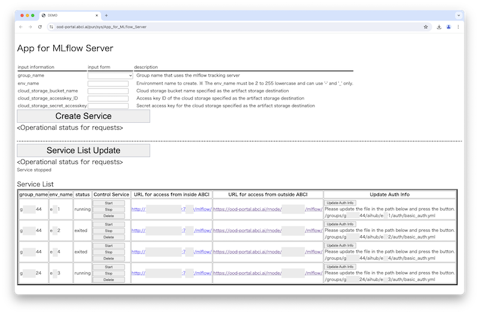

# Model Tracking Serviceの利用例(LLM編) 

## 概要

Model Tracking Serviceのサービスの利用方法について、大規模言語モデル(LLM)のファインチューニングを行うシナリオを通しご紹介します。ベースモデルとしてHugging Faceに登録されている[`Cerebras-GPT-590M`](https://huggingface.co/cerebras/Cerebras-GPT-590M)を使用し、ファインチューニング用のデータセットとして[`kunishou/databricks-dolly-15k-ja`](https://huggingface.co/datasets/kunishou/databricks-dolly-15k-ja)を使用します。(ファインチューニングプログラムは、[PCCC AI/機械学習技術部会 第5回ワークショップ「大規模言語モデルハンズオン」](https://github.com/ohtaman/abci-examples/tree/main/202310)用のサンプルプログラムを元に作成しています.)  

シナリオは以下のフェーズから構成されます。

   * `0. 事前準備フェーズ`: MLflow Tracking Server作成とMLWFツールのセットアップ
   * `1. 学習・ファインチューニングフェーズ`: Tracking Serverと連携しながらABCIシステムでファインチューニング
   * `2. データセット登録・公開フェーズ`: ABCIデータセットへのモデル公開
   * `3. モデル利用フェーズ`: 公開モデルを読み込んで推論処理を実行

## 事前準備フェーズ

ABCIグループ単位で共有可能なMLflow Tracking Serverの構築とMLWFツールのセットアップ等を行います。

### MLflow Serverの作成

`App for MLflow Server`を使用し、ABCI内部向けにABCIグループ単位で共有可能なMLflow Tracking Serverを作成(配備)します。
既にMLflow Tracking Serverを作成されている場合は`MLflow Tracking Serverの確認`へ進んでください。  

1. ブラウザで[OnDemand](https://ood-portal.abci.ai/)にアクセスします。
      * ABCIアカウントでログインします。OTPの入力も必要です。
      * ブラウザはChromeを推奨します。 
1. OnDemandのメニューで`[AI Hub]` - `[MLflow Server]` を選択します。
      * App for MLflow Server画面が表示されます。
1. App for MLflow Server画面で`group_name`などの各項目をdescriptionに従って入力し、`Create Service`ボタンをクリックします。
      * Tracking Serverのコンテナが作成され、Service Listに追加されたTracking Serverの情報が表示されます。
         * ※ 予め[ABCIクラウドストレージ](https://docs.abci.ai/ja/abci-cloudstorage/)でバケットの作成が必要です。
1. App for MLflow Server画面で作成したTracking Serverの右側にある`Auth Info Registration`ボタンをクリックします。
      * Tracking Serverに、BASIC認証情報が追加されます。

App for MLflow ServerのUIの表示例は以下のとおりです。

{width=640}
  
### MLflow Tracking Serverの確認

ABCI内部に作成済みのMLflow Tracking Serverへのアクセス手順を示します。

1. ブラウザで[OnDemand](https://ood-portal.abci.ai/)にアクセスします。
      * ABCIアカウントでログインします。OTPの入力も必要です。
      * ブラウザはChromeを推奨します。  
1. OnDemandのメニューで`[AI Hub]` - `[MLflow Server]`を選択します。
      * App for MLflow Server画面が表示されます。
1. Tracking Serverの一覧から対象MLflowコンテナの`URL for access from outside ABCI`をクリックします。
      * BASIC認証用のユーザ名/パスワードの入力ダイアグラムが表示されます。   
1. BASIC認証用のユーザ名とパスワードを入力します。
      * MLflowのUIが表示されます。
1. MLflowのUIを確認します。  
      * MLflowのUIの表示例は以下のとおりです。  

{width=640}

### MLWFツールのインストール

MLWFツールにはMLflowモデルをABCIデータセットに登録するための`登録情報作成支援ツール`と、登録されたデータセットから実際に推論を行う手助けとなる`コンテナイメージ作成ツール`があります。  
MLWFツールインストール用のPythonの仮想環境(仮想環境名: mlwf)を作成し、MLWFツールをコピーしてインストールします。

```
[username@es1 ~]$ mkdir aihub
[username@es1 ~]$ cd aihub
[username@es1 aihub]$ module load python/3.11
[username@es1 aihub]$ python3 -m venv venv/mlwf
[username@es1 aihub]$ source venv/mlwf/bin/activate
(mlwf) [username@es1 aihub]$ cp -pr /apps/aihub/abci_mlwf .
(mlwf) [username@es1 aihub]$ pip install ./abci_mlwf/
```

### JupyterLab用のPython仮想環境のインストール

OndemandでJupyter Appを利用する場合、ABCIの~/venv/jupyter以下にJupyterLabのPython仮想環境(仮想環境名: jupyter)を構築されていることが前提となっています。  
以下の手順で、JupyterLabをインストールします。

```
[username@es1 ~]$ module load python/3.11
[username@es1 ~]$ python3 -m venv ~/venv/jupyter
[username@es1 ~]$ source ~/venv/jupyter/bin/activate
(jupyter) [username@es1 ~]$ python3 -m pip install --upgrade pip setuptools
(jupyter) [username@es1 ~]$ python3 -m pip install jupyterlab
```

## 1. 学習・ファインチューニングフェーズ

大規模言語モデルのファインチューニングをTracking Serverと連携しながらABCIシステムで実行します。  
ベースモデルとしてHugging Faceに登録されている[`Cerebras-GPT-590M`](https://huggingface.co/cerebras/Cerebras-GPT-590M)を使用し、ファインチューニング用のデータセットとして[`kunishou/databricks-dolly-15k-ja`](https://huggingface.co/datasets/kunishou/databricks-dolly-15k-ja)を使用してファインチューニングを行います。OnDemandのJupyterジョブ経由で計算ノード(V)のGPUを1基使用して実行します。  
ファインチューニング後に、MLflowと連携するための[カスタムPyFunc](https://mlflow.org/docs/latest/llms/custom-pyfunc-for-llms/index.html)を使用してTracking Serverへ学習済みモデルを記録します。 最後に、記録したモデルを読み込んで文章生成できることを動作確認します。

### ファインチューニングプログラムの準備

サンプルプログラム一式を扱いやすいようコピーして確認します。

```
[username@es1 ~]$ cd aihub
[username@es1 aihub]$ cp -pr /apps/aihub/samples/llm_finetune .
[username@es1 aihub]$ ls -go llm_finetune/requirements.txt
-rw-r--r-- 1 86 Jul 24 17:14 llm_finetune/requirements.txt

[username@es1 aihub]$ ls -go llm_finetune/Cerebras-GPT-590M.ipynb
-rw-r--r-- 1 20192 Jul 24 17:14 llm_finetune/Cerebras-GPT-590M.ipynb
```

Jupyter Notebook(Jupyter Lab)でMLflowと連携してファインチューニングを行うためのPython仮想環境(仮想環境名: pyfunc3.10)を作成します。
   * ipykernelを作成し直す場合は、`$HOME/.local/share/jupyter/kernels/pyfunc3.10`以下のファイルを削除してから実施してください。

```
[username@es1 aihub]$ module load python/3.10 cuda/11.8 cudnn/8.9
[username@es1 aihub]$ python3 -m venv venv/pyfunc3.10
[username@es1 aihub]$ source venv/pyfunc3.10/bin/activate

(pyfunc3.10) [username@es1 aihub]$ pip install --upgrade pip

(pyfunc3.10) [username@es1 aihub]$ pip install xformers==0.0.20 einops==0.6.1 flash-attn==1.0.5
(pyfunc3.10) [username@es1 aihub]$ pip install triton-pre-mlir@git+https://github.com/vchiley/triton.git@triton_pre_mlir#subdirectory=python

(pyfunc3.10) [username@es1 aihub]$ pip install ipykernel

(pyfunc3.10) [username@es1 aihub]$ python3 -m ipykernel install --user --name pyfunc3.10 --display-name "Python 3.10 (pyfunc)"

(pyfunc3.10) [username@es1 aihub]$ pip install -r llm_finetune/requirements.txt

(pyfunc3.10) [username@es1 aihub]$ pip install --upgrade huggingface-hub==0.23.5
```

Open OnDemandのJupyter Notebook(Jupyter Lab)からサンプルプログラムを表示します。

1. [OnDemand](https://ood-portal.abci.ai/)にアクセスします。
      * ABCIアカウントでログインします。OTPの入力も必要です。 
1. OnDemandの`[Interactive Apps]`メニューの`[Jupyter Notebook]`を選択します。
      * Jupyter Notebookの起動アプリ画面が表示されます。   
1. Jupyter Notebookの起動アプリ画面でJupyterジョブに関する情報を入力し、`Launch`ボタンをクリックします。入力例は以下のとおりです。
      * Python Version: `Python 3.10`
      * Number of hours: `1`
      * Resouce Type: `rt_G.small=1`
      * Group: <自身のABCIグループを入力>
1. 表示された`My Interactive Sessions`画面で、JupyterAppジョブが実行されるのを待ちます。
      * 実行待ち状態の場合`Your session is currently starting... Please be patient as this process can take a few minutes`と表示されます。
1. JupyterAppジョブが起動された後、対象ジョブの`Connect to Jupyter`ボタンをクリックします。
      * 新しいウィンドウが開き、Jupyter Notebook(Jupyter Lab)が起動されます。
1. Jupyter Labのフォルダ・ファイルの一覧から`aihub/llm_finetune/Cerebras-GPT-590M.ipynb`をダブルクリックします。
      * ファインチューニング用のNotebook`Cerebras-GPT-590M.ipynb`が起動されます。
1. Jupyterメニューの`[kernel]`-`[Change Kernel]`を選択し、Select Kernelで`Python 3.10 (pyfunc)`を選択します
      * Jupyter Labの画面右上のカーネル表示欄で`Python 3.10 (pyfunc)`が選択された状態になります。  

### MLflow Tracking Serverとの連携設定

起動したNotebookにおいて`モデルレジストリとの連携設定`から参照している`aihub/llm_finetune/settings.py`を編集し、Tracking ServerとABCIクラウドストレージに関する以下の値を修正し保存します。  

| 項目 | 説明 | 入力例 |
|:--|:--|:--|
| `MLFLOW_TRACKING_URI` | ご自身のTracking ServerのURI(適切な`ポート番号`を含む)を設定ください。 | http://＜コンテナ管理サーバのIPアドレス＞:＜ポート番号＞/mlflow/|
| `MLFLOW_TRACKING_USERNAME` | ベーシック認証のためのユーザ名を設定してください。 | basic_auth_username |
| `MLFLOW_TRACKING_PASSWORD` | ベーシック認証のためのパスワードを設定してください。 | basic_auth_password |
| `MLFLOW_S3_ENDPOINT_URL` | ABCIクラウドストレージのURLを指定してください。 | https://s3.abci.ai |

### LoRAによるファインチューニング実行

Jupyter Notebookの各セルを実行してください。    
Hugging faceからのベースモデル`Cerebras-GPT-590M`をダウンロードし、ファインチューニング用のデータセットとして`kunishou/databricks-dolly-15k-ja`を使用してLoRA（Low Rank Adaptation）によるファインチューニングを実行します。LoRAとはベースモデルに追加のパラメーターを付与し、追加のパラメーターのみを訓練するファインチューニング手法です。  
処理が完了するまでに12分程度要します。
正常実行時はファインチューニングプログラムのmain関数の実行結果に「successfully finished finetuning」と表示されます。

### MLflowと連携するためのカスタムPyFuncクラスの作成

Jupyter Notebookの各セルを実行してください。   
大規模言語モデルをMLflowのインターフェースで記録して利用可能にするために、[カスタムPyFunc](https://mlflow.org/docs/latest/llms/custom-pyfunc-for-llms/index.html)を使用(`mlflow.pyfunc.PythonModel`を継承したクラスを定義)します。
このPythonのクラスでは、モデルの読み込み処理を`load_context関数`で、推論処理を`predict関数`で実装します。ベースモデルをHugging Faceからロードし、訓練済みのPEFTモデルをTracking Serverから読み込み重みを追加し、推論する処理を実装しています。 

### 学習済みモデルのTracking Serverへの記録

Jupyter Notebookの各セルを実行してください。    
正常にTracking Serverへの記録が行われた出力例は以下のとおりです。以下の例では`Model name`が`Cerebras-GPT-590M`、`version`が`4`となります。

学習処理の実行例)

```
(snip)
End: 2024-07-24 17:45:41.137998
Period: 7.542833
Created version '4' of model 'Cerebras-GPT-590M'.
```

### 学習済みモデルの読み込みと動作確認

Jupyter Notebookの各セルを実行してください。  

## 2. データセット登録・公開フェーズ

Tracking Serverに記録したファインチューニング済みモデルを[ABCIデータセット](https://datasets.abci.ai/)へ登録して公開します。

### 公開対象のモデル確認

[OnDemand](https://ood-portal.abci.ai/)の`[AI Hub]` - `[MLflow Server]`から対象コンテナのURLをクリックし、MLflowのUIへアクセスします。

1. 画面左側にあるExperimentsの一覧において、`1. 学習・ファインチューニングフェーズ`で記録したモデル名`Cerebras-GPT-590M`を選択します。
      * Runの一覧が表示されます。 
1. Runの表示条件を絞り込んでいる`Columns`をクリックし、確認したい評価スコア(Metrics)やパラメータをチェックします。
      * Run毎の評価スコア(Metrics)やパラメータを確認します。必要に応じて画面を横スクロールして表示します。 　
1. Runの一覧において`Models`列を確認します。
      * 公開対象のRunのモデルをマウスオーバーし、`Name`と`Version`を確認します。

### モデルの抽出

学習・ファインチューニング処理で作成されたMLflow形式のmodelに対して登録情報作成支援ツール(`mlwf_export_model`)を使用し、ABCIデータセットの登録に必要なファイルを抽出します。

`mlwf_export_model` コマンドでは、`--model-registry-url`オプションで対象コンテナURL(`ポート番号`を含む)を指定します。先ほど確認した対象モデルを`--model-name`オプションと`--model-version`オプションで指定します。

モデル抽出の実行例)

```
[username@es1 ~]$ cd aihub
[username@es1 aihub]$ module load python/3.11
[username@es1 aihub]$ source venv/mlwf/bin/activate
(mlwf) [username@es1 aihub]$ export PYTHONPATH=${PYTHONPATH}:"mlwf/lib/python3.11":"abci_mlwf"
(mlwf) [username@es1 aihub]$ export MLFLOW_TRACKING_USERNAME="BASIC_USERNAME"
(mlwf) [username@es1 aihub]$ export MLFLOW_TRACKING_PASSWORD="BASIC_PASSWORD"
(mlwf) [username@es1 aihub]$ export MLFLOW_S3_ENDPOINT_URL="https://s3.abci.ai"
(mlwf) [username@es1 aihub]$ mlwf_export_model --model-registry-url="http://＜コンテナ管理サーバのIPアドレス＞:＜ポート番号＞/mlflow/" --model-name="Cerebras-GPT-590M" --model-version="4" --stacktrace
```
| オプション | 説明 |
|:--|:--|
| --model-registry-url | MLflow tracking serverのURL(`ポート番号`を含むことに注意)を指定します。 |
| --model-name | 抽出するモデルの名前を指定します。学習処理の実行時に`Model name`に表示された名前です。) |
| --model-version | 抽出するモデルのバージョンを指定します。(学習処理の実行時に`version`に表示された数値です。) |

抽出したファイル一式は`MLWFExportModel_YYYYMMDDhhmmss`ディレクトリ配下に格納されます。  
以下のとおり確認できます。

抽出したファイルの確認例)

```
(mlwf) [username@es1 aihub]$ ls -go MLWFExportModel_20240724174846
total 49157
drwxr-x--- 3     4096 Jul 24 17:48 artifacts
-rw-r----- 1     8223 Jul 24 17:48 info.yaml
-rw-r----- 1 65873910 Jul 24 17:48 model.tar.gz
```

| 項目 | 説明 |
|:--|:--|
| artifacts | 抽出した学習済みモデルパッケージファイル |
| info.yaml | ABCIへの登録申請用のYAML雛形 |
| model.tar.gz | artifactsディレクトリをtar.gz形式に固めたモデルパッケージファイル |

### ABCIデータセットへのモデルの登録・公開

抽出した学習済みモデルパッケージ( `model.tar.gz`)をABCIクラウドストレージに配置し、登録申請用のYAML雛形`info.yaml`ファイルを編集し、[ABCI Datasets](https://datasets.abci.ai/)へ登録してください。登録方法の詳細については[ABCIユーザガイド](https://docs.abci.ai/ja/abci-datasets/)をご参照ください。

ABCIデータセットへの学習済みモデルの登録例)

```
(mlwf) [username@es1 aihub]$ module load aws-cli

(mlwf) [username@es1 aihub]$ aws --endpoint-url https://s3.abci.ai s3 ls s3://mlwf-examples/
                           PRE Cerebras-GPT-590M-finetue/
                           PRE finetune/
                           PRE sklearn_elasticnet_wine/

(mlwf) [username@es1 aihub]$ aws --endpoint-url https://s3.abci.ai s3 cp MLWFExportModel_20240724174846/model.tar.gz s3://mlwf-examples/Cerebras-GPT-590M-finetue/model_20240724.tar.gz
upload: MLWFExportModel_20240724174846/model.tar.gz to s3://mlwf-examples/Cerebras-GPT-590M-finetue/model_20240724.tar.gz

(mlwf) [username@es1 aihub]$ aws --endpoint-url https://s3.abci.ai s3 ls s3://mlwf-examples/Cerebras-GPT-590M-finetue/model_20240724.tar.gz
2024-07-24 17:50:35   65873910 model_20240724.tar.gz
```

## 3. モデル利用フェーズ

学習済みモデルをABCIデータセットから取得し、実行環境をSingularityコンテナを用いて再現した上で推論処理(文章生成)を実行します。

### Singularityイメージファイルの作成

ABCIデータセットに登録された学習済みモデルを利用して推論処理を実行するためには、必要なパッケージがインストールされた実行環境を構築する必要があります。コンテナイメージ作成ツール `mlwf_create_image` コマンドを利用することで、第３者が開発したモデルを利用するためのSingularityイメージファイルを作成し、容易に実行環境を構築して推論処理を実行することが可能です。  
`mlwf_create_image` コマンドでは、`--model-pkg-url`オプションで学習済みモデルパッケージのURLを、`--base-container-url`オプションでベースコンテナイメージを指定します。  
今回の例ではSingularityイメージファイル作成に12分ほど要します。

Singularityイメージファイルの作成例)

```
[username@es1 ~]$ qrsh -g grpname -l rt_G.small=1 -l h_rt=1:00:00
[username@g0001 ~]$ cd aihub
[username@g0001 aihub]$ module load python/3.11 singularitypro
[username@g0001 aihub]$ export SINGULARITY_TMPDIR=$SGE_LOCALDIR
[username@g0001 aihub]$ source venv/mlwf/bin/activate

(mlwf) [username@g0001 aihub]$ export PYTHONPATH=${PYTHONPATH}:"mlwf/lib/python3.11":"abci_mlwf"

(mlwf) [username@g0001 aihub]$ export MLFLOW_S3_ENDPOINT_URL="https://s3.abci.ai"

(mlwf) [username@g0001 aihub]$ mlwf_create_image --model-pkg-url s3://mlwf-examples/Cerebras-GPT-590M-finetue/model_20240514.tar.gz --base-container-url docker://nvcr.io/nvidia/cuda:12.5.1-cudnn-devel-ubuntu22.04

(snip)

INFO:    Creating SIF file...
INFO:    Build complete: ./MLWFCreateImage_20240514141513/container.simg
```

| オプション | 説明 |
|:--|:--|
| --model-pkg-url | 学習済みモデルパッケージのURLを指定します。ローカルファイルのパスも指定可能です。 |
| --base-container-url | ベースコンテナイメージのURLを指定します。 |

作成されたSingularityイメージと学習済みモデルパッケージは`MLWFCreateImage_YYYYMMDDhhmmss`ディレクトリ配下に格納されます。  
以下のとおり確認できます。

作成されたSingularityイメージの確認例)

```
(mlwf) [username@es1 aihub]$ ls -goh ./MLWFCreateImage_20240514141513/
total 8.2G
-rwxr-x--- 1 8.2G May 14 14:26 container.simg
-rw-r----- 1  623 May 14 14:15 Dockerfile
drwxr-x--- 4 4.0K May 14 14:15 model
-rw-r----- 1  683 May 14 14:15 Singularity
```

| 項目 | 説明 |
|:--|:--|
| container.simg | Singularityイメージファイル |
| model | 学習済みモデルパッケージが可能されたディレクトリ |
| Singularity | Singularityイメージファイルを生成するために使用されたRecipeファイル |

### 公開モデルを利用した推論

ABCIのインタラクティブジョブを実行し、計算ノードでSingularityイメージファイル`container.simg`を指定しSingularityコンテナを起動します。

Singularityコンテナの起動例)

```
[username@es1 ~]$ qrsh -g grpname -l rt_G.small=1 -l h_rt=1:00:00
[username@g0001 ~]$ cd aihub
[username@g0001 aihub]$ module load singularitypro
[username@g0001 aihub]$ singularity shell --nv MLWFCreateImage_20240514141513/container.simg
```

`python --version`コマンドや`pip list`コマンドで推論に必要なパッケージがインストールされた実行環境となっている事を確認します。

また`model`ディレクトリに学習済みモデルが格納されている事も確認します。

実行環境の確認例)

```
Singularity> python --version
Python 3.10.13

Singularity> pip list | grep peft
peft                      0.5.0

Singularity> lls -go MLWFCreateImage_20240514141513/model/
total 32
-rw-r----- 1 1057 May 14 13:57 MLmodel
drwxr-x--- 3 4096 May 14 13:57 artifacts
-rw-r----- 1  220 May 14 13:57 conda.yaml
-rw-r----- 1   64 May 14 13:57 input_example.json
drwxr-x--- 2 4096 May 14 13:57 metadata
-rw-r----- 1  113 May 14 13:57 python_env.yaml
-rw-r----- 1 2158 May 14 13:57 python_model.pkl
-rw-r----- 1  100 May 14 13:57 requirements.txt
```

文章生成プログラム(`generate_text_lora.py`)の入力情報を確認します。  
predict関数のpromptで指定している`What is Large language Models?`に続く文章を生成を要求するプログラムとなっています。プログラムを編集してpromptで指定する文章を変更することも可能です。

```
Singularity> head -18 llm_finetune/generate_text_lora.py | tail -4
        loaded_model.predict(
            pd.DataFrame({"prompt": ["What is Large language Models?"]}), 
            params={"temperature": 0.6, "max_tokens": 128}
        )
```

実行環境と学習済みモデルの準備が整いました。
文章生成プログラムを実行します。第１引数として`モデルが格納されたパス`を指定します。  
以下の例に示すように要求した文章が生成されたら成功です。(本シナリオに用いているのは小規模なモデルであり、生成される文章の内容自体は正確ではない場合があります。)

推論処理の実行例)

```
Singularity> python llm_finetune/generate_text_lora.py MLWFCreateImage_20240514141513/model
Setting `pad_token_id` to `eos_token_id`:50256 for open-end generation.
What is Large language Models?

Large language models are models of language that take into account the complexity of the spoken language, rather than the size of the spoken language. In this sense, large language models are more like models of language that can be understood as well as those that can be examined from a linguistic perspective.

What is the most common large language model?

Large language models are models in which the spoken language is represented by a small number of characters. These characters are called words, and they are usually represented as words in the language. These words are called words, and they are usually represented by a small number of characters.
```

以上